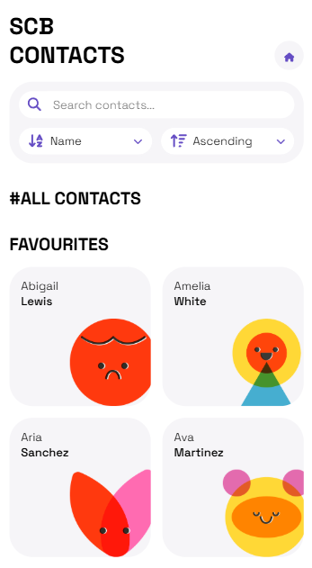

<!-- PROJECT -->

<a id="readme-top"></a>

<div align="center">
 

  <h3 align="center">Simple Contacts Book</h3>

  <p align="center">
    A personal project made the Frontend - Coding Bootcamp at Edgemony.
  </p>
</div>

<!-- TABLE OF CONTENTS -->
<details>
  <summary>Table of Contents</summary>
  <ol>
    <li>
      <a href="#about-the-project">About The Project</a>
        <li>
            <a href="#built-with">Built With</a>
        </li>
    </li>
        <li>
            <a href="#system-architecture">System Architecture</a>
        </li>
        <li>
            <a href="#data-flow">Data Flow</a>
        </li>
    <li>
        <a href="#getting-started">Getting Started</a>
    </li>
    <li>
        <a href="#contacts">Contacts</a>
    </li>
        <li>
        <a href="#credits">Credits</a>
    </li>
    <li>
        <a href="#license">License</a>
    </li>
  </ol>
</details>

<!-- ABOUT THE PROJECT -->

## About The Project

SCB is a contacts book, which features reading, editing, adding, deleting contacts, filtering and groupings your contacts. Simple Contacts Book is designed to be accessible, intuitive but also with character.

### Built With

<!-- BUILT WITH -->

<div style="display: flex; align-items: center; gap: 0.5rem">
  
	
	
	
	
	
	
</div>

## System Architecture

The project is a React-based web application that uses a combination of functional components, context providers, and APIs to manage data and state. The application interacts with a Supabase database using the Supabase client.

- `components`: the application is built using a variety of reusable React components following the structure of Atomic Design, including atoms (e.g., `Button`, `Loader`), molecules (e.g., `FormAlertDialog`), and templates (e.g., `ContactDetailsForm`). Some components (mainly used on forms) use RadixUI Primitives library to optimize accessibility.
- `providers`: contains context providers and their custom hooks to manage state and data throughout the app, including `ContactsContext`, `OrderContext`, `FilterContext`, and `SortByContext`.
- `supabase`:
  - `supabase/functions`: contains API routes for interacting with the Supabase database, providing methods for CRUD (Create, Read, Update, Delete) operations on contacts data and a custom function from the database to generate random avatars.
  - `supabase/supabaseClient`: provides a connection to the database.
  - `supabase/database.types`: generated from the database and used with typescript to almost automatically handle database types.

<p align="right">(<a href="#readme-top">back to top</a>)</p>

## Data Flow

1. Components render and fetch data using database functions.
2. APIs interact with the Supabase client to perform operations on the database.
3. Supabase client sends requests to the Supabase database.
4. Supabase database returns data to the Supabase client.
5. Supabase client returns data to the APIs.
6. APIs update application state and notify components of changes.
7. Context providers update and serve updated data throughout the app.
8. Components re-render with updated data.

<p align="right">(<a href="#readme-top">back to top</a>)</p>

<!-- GETTING STARTED -->

## Getting Started

To get a local copy up and running follow these steps.

### Prerequisites

- Node.js (version 14 or higher)
- npm (version 6 or higher)
- A code editor or IDE of your choice

### Cloning the Repository

1. Open a terminal or command prompt and navigate to the directory where you want to clone the repository.
2. Run the following command to clone the repository:
   ```sh
   git clone https://github.com/majinbrum/simple-contacts-book.git
   ```

### Installing Dependencies

1. Navigate to the cloned repository directory:
   ```sh
   cd simple-contacts-book
   ```
2. Run the following command to install the dependencies (this may take a few minutes to complete):
   ```sh
    npm install
   ```

### Setting up the Environment

1. Create a new file named `.env.local` in the root directory of the project.
2. Add the following environment variables to the `.env` file:
   ```sh
    VITE_SUPABASE_URL=...
    VITE_SUPABASE_ANON_KEY=...
   ```
   Replace the `...` with the actual values. If you don't own them, feel free to contact me!

### Starting the Application

1. Run the following command to start the application:
   ```sh
    npm run dev
   ```
   This will start the development server and make the application available at `http://localhost:5173`.

<p align="right">(<a href="#readme-top">back to top</a>)</p>

<!-- CONTACTS -->

## Contacts

**Bruna Alamia** **-** [@linkedin](https://linkedin.com/in/brunaalamia) **-** brunaalamia@gmail.com

<p align="right">(<a href="#readme-top">back to top</a>)</p>

<!-- CREDITS -->

## Credits

The projects uses:

- [RadixUI Primitives](https://www.radix-ui.com/primitives) to optimize accessibility
- [FontAwesome](https://fontawesome.com/) Free Icons as SVG files
- [Freepik](https://www.freepik.com/serie/33232973) avatars, but I edited them to adapt the style and size to the project design.

<!-- LICENSE -->

## License

This project is licensed under the MIT License.

<p>Copyright (c) 2024 Bruna Alamia

Permission is hereby granted, free of charge, to any person
obtaining a copy of this software and associated documentation
files (the "Software"), to deal in the Software without
restriction, including without limitation the rights to use,
copy, modify, merge, publish, distribute, sublicense, and/or sell
copies of the Software, and to permit persons to whom the
Software is furnished to do so, subject to the following
conditions:

The above copyright notice and this permission notice shall be
included in all copies or substantial portions of the Software.

THE SOFTWARE IS PROVIDED "AS IS", WITHOUT WARRANTY OF ANY KIND,
EXPRESS OR IMPLIED, INCLUDING BUT NOT LIMITED TO THE WARRANTIES
OF MERCHANTABILITY, FITNESS FOR A PARTICULAR PURPOSE AND
NONINFRINGEMENT. IN NO EVENT SHALL THE AUTHORS OR COPYRIGHT
HOLDERS BE LIABLE FOR ANY CLAIM, DAMAGES OR OTHER LIABILITY,
WHETHER IN AN ACTION OF CONTRACT, TORT OR OTHERWISE, ARISING
FROM, OUT OF OR IN CONNECTION WITH THE SOFTWARE OR THE USE OR
OTHER DEALINGS IN THE SOFTWARE.</p>
